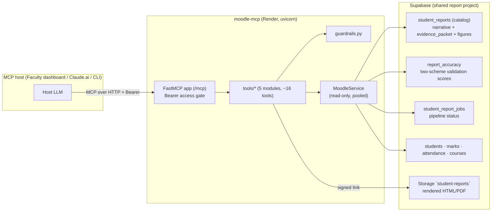

# Jaipuria Moodle MCP — Technical Architecture

> Deep-dive reference for the **faculty-facing, read-only** Moodle Reports MCP server.
> Exposes the generated student performance reports, the deterministic cohort analytics, and the
> two-scheme accuracy scores (`report_accuracy`) so a dashboard / host LLM can query them.
> Design lineage: the Rehearsal MCP (read-only, bounded, routing-contract tools) — adapted from a
> per-student RLS model to a **role-based, campus-scoped faculty model**.

## 1. System context

The server sits between an MCP host (a faculty dashboard, Claude.ai, ChatGPT, CLI) and the
`student-report-system/1.0.0` Supabase project. It exposes **read-only tools** that return
structured rows scoped to the faculty caller's allowed campuses; the host LLM frames and summarises.



Sibling systems on the same project:
- **`moodle-agent`** — the pipeline that *writes* everything this server reads (ingestion → calc →
  narrative → validation → `student_reports` / `report_accuracy`).
- The MCP is **read-only forever**; it never triggers ingestion, generation, or mailing.

## 2. Why this MCP is different (and exclusive)

It is not a generic table browser. It exposes three things no raw DB view gives a dashboard:

1. **Finished, validated reports** — the human-readable narrative + the deterministic figures the
   renderer used, already joined (`student_reports.evidence_packet` + `narrative`).
2. **Accuracy as first-class data** — every report carries a two-scheme score
   (faithfulness panel + two-turn LLM judge). Tools can answer *"show me flagged reports"* or
   *"what is this cohort's mean accuracy"* — impossible without the validation layer we built.
3. **Early-warning analytics** — `at_risk_students`, `attendance_watch`, `zero_alerts` turn raw
   marks/attendance into the exact triage a programme office acts on.

## 3. Tenant-isolation model (role-based, campus-scoped)

Unlike the student MCP (per-user RLS on `auth.uid()`), this server serves faculty who see
*institutional* data for their campuses. Boundaries:

1. **Bearer access gate** — every request carries `Authorization: Bearer <token>`. A token maps to
   a faculty principal with an **allowed-campus set** (`MCP_TOKENS` config, or a signed JWT with a
   `campuses` claim). No token → 401, fail-closed.
2. **Server-side scoping** — every tool applies `.in_("campus", allowed_campuses)` (or `.eq` for a
   single-campus token). A caller can never widen scope by passing a campus they aren't granted;
   requested campus is intersected with the granted set.
3. **Read-only service role** — the Supabase service key lives only server-side (never exposed to
   the host). All tools are `SELECT`-only; there is no write path in the codebase.
4. **Secret stripping** — `strip_secrets()` removes storage object keys, raw tokens, and internal
   ids from every projected row. Rendered-report access is via a short-lived signed URL, never a
   raw path.

Supporting rules (`guardrails.py`): UUID/id pre-validation → clean miss (no Postgres `22P02`
leak); uniform `{"found": false}` for missing-vs-out-of-scope (no existence oracle); soft-deleted
/ non-`ready` rows excluded from student-facing report reads.

## 4. Runtime stack

| Layer | Choice | Notes |
|---|---|---|
| MCP framework | `fastmcp >= 2.14, < 3` | Tool registration, HTTP transport |
| ASGI | Starlette (`mcp.http_app()`) + uvicorn | `GET /health` prepended for Render |
| DB client | `supabase-py >= 2.5` (PostgREST) | Read-only service role, server-side only |
| Validation | pydantic v2 + pydantic-settings | Typed tool params + env config |
| HTTP | httpx (bounded shared client) | Signed-URL fetches |
| Caches | in-process bounded `TTLCache` | No unbounded module dict, ever (OOM invariant) |

Single process, no background threads, no external cache.

## 5. Data-access layer (`supabase_client.py`)

`MoodleService` — thin, read-only, pooled:
- Constructed once per process with the service key; **one `Client`** reused (report data is not
  per-user, so unlike the student MCP no per-user pool is needed — a single bounded client).
- `allowed_campuses` is attached per request from the verified token; every query helper applies it.
- Aggregation helpers use `count="exact"` head queries and explicit pagination — PostgREST caps
  result rows at 1000, so counts/analytics never rely on a single unpaged `select` (a lesson baked
  in from the pipeline).

## 6. Tool layer (`tools/`)

### 6.1 Module contract (same shape as Rehearsal)
```python
class XxxParams(BaseModel): ...        # host-facing field descriptions
def _impl(svc, ...) -> dict: ...       # pure logic, testable with a FakeSvc
def register(mcp, get_service):
    @mcp.tool(annotations=READONLY_ANNOTATIONS)
    async def tool_name(params: XxxParams) -> dict:
        svc = await get_service()      # access-checked, campus-scoped
        return _impl(svc, ...)
```
Conventions: **routing-contract docstrings** (`WHAT / USE WHEN / DO NOT USE / RETURNS`),
`READONLY_ANNOTATIONS` (auto-approvable), param models over loose kwargs, response-size budgets.

### 6.2 Module × tool inventory

| Module | Tools | Primary sources |
|---|---|---|
| `reports.py` | `search_students`, `get_student_report`, `report_pipeline_status` | `student_reports`, `student_report_jobs` |
| `analytics.py` | `campus_overview`, `subject_performance`, `cohort_compare` | `students`, `marks`, `attendance`, `courses` |
| `accuracy.py` | `get_report_accuracy`, `accuracy_overview`, `flagged_reports` | `report_accuracy` |
| `at_risk.py` | `at_risk_students`, `attendance_watch`, `zero_alerts` | `student_reports.evidence_packet`, `marks`, `attendance` |
| `leaderboard.py` | `top_performers`, `most_improved`, `strength_map` | `student_reports`, `marks` |
| *(server.py)* | `whoami`, `health` | token claims |

## 7. Response-size budgets & paging

Token discipline is a contract (shared constants in `guardrails.py`):
- `LIST_PREVIEW_CHARS = 400` — list cards carry a bounded preview, never the full narrative.
- Full report bodies only behind `get_student_report` (paged narrative sections).
- Lists cap at `MAX_LIST = 50` with `next_offset` / `has_more`.
- Students addressed by name + enrolment id; internal `run_id` / object keys never leave the server.

## 8. Caching & memory invariants (OOM-safe)

| Cache | Bound | Purpose |
|---|---|---|
| `_run_cache` | `TTLCache(64 × 300s)` | latest `final` run_id per (campus,batch) |
| `_cohort_cache` | `TTLCache(16 × 300s)` | per-run aggregate rollups |
| `http._client` | shared `httpx.AsyncClient`, 20 conns | signed-URL fetches |

## 9. Configuration (`config.py`)

| Group | Vars |
|---|---|
| Supabase | `SUPABASE_URL`, `SUPABASE_SERVICE_ROLE_KEY` |
| Access | `MCP_TOKENS` (JSON: `token → {name, campuses}`), or `MCP_ADMIN_TOKEN` (all campuses) |
| Identity | `MCP_SERVER_NAME`, `MCP_SERVER_VERSION`, `MCP_SERVER_BASE_URL` |
| Reports | `REPORT_PUBLIC_BASE_URL` (for `get_student_report` links), `STORAGE_BUCKET` |

`validate_config()` is a fail-closed boot check. All logging → stderr; log lines never contain
token contents or PII.

## 10. Deployment & publishing

- **Render web service** (`render.yaml`): Python 3.12, `uvicorn server:app --port $PORT`.
- **`Dockerfile`**: `python:3.12-slim`, non-root user, mirrors render.
- Public endpoint: `https://moodle-mcp.<domain>/mcp`; `GET /health` for platform checks.
- Connect from any MCP host with the `/mcp` URL + a faculty bearer token.

## 11. Design invariants (checklist for new tools)
1. Read-only forever — no tool mutates state.
2. Campus-scope every query with the token's allowed set; intersect requested campus.
3. Validate ids; map failure to `not_found()`; uniform `found:false`.
4. `strip_secrets()` every row; object keys / run_ids never leave the server.
5. Lists within budget + `next_offset`; full bodies only behind a paged get.
6. Degrade gracefully (`available:false`, notes) on missing table / empty scope — never 500.
7. Any new cache bounded (`TTLCache`).
8. `READONLY_ANNOTATIONS` + `WHAT / USE WHEN / DO NOT USE / RETURNS` docstring (the routing contract).
