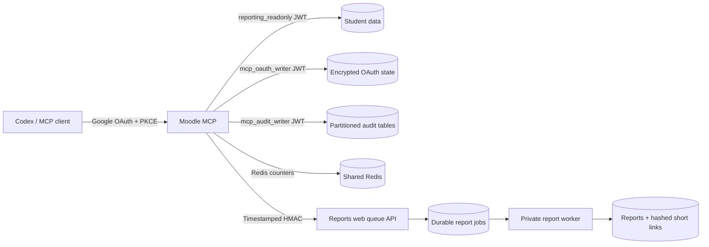

# Moodle MCP security and 5,000-user release plan

**Prepared:** 2026-09-07  
**Repositories:** `Moodle-MCP` and `Moodle-Analysis-Agent`  
**Status:** code-complete candidate; database migration and production deployment are deliberately
not performed by this commit.

This document records the end-to-end changes, the Supabase data model, and the ordered cutover
needed before a team-wide release. It is also the rollback and verification runbook.

## 1. Outcome

The release changes the system from a single-instance, shared-secret design into a horizontally
scalable foundation:



The MCP records privacy-safe activity metadata, not raw prompts, student identifiers, access
tokens, tool arguments, or tool results. This is intentional: operational auditability does not
require creating a second copy of sensitive educational data.

## 2. Changes made

### Moodle-MCP

- Split the previous Supabase credential into three least-privilege JWTs:
  `SUPABASE_DATA_KEY`, `SUPABASE_OAUTH_STORAGE_KEY`, and `SUPABASE_AUDIT_KEY`.
- Kept `SUPABASE_SERVICE_ROLE_KEY` only as a temporary data-read fallback. Production should not
  set it after cutover.
- Decoupled OAuth-state encryption from OAuth token signing with
  `OAUTH_STORAGE_ENCRYPTION_KEY`.
- Made cross-client PKCE compatibility deny-by-default and bounded any explicit exception to
  `OAUTH_REDIRECT_HOSTS`.
- Added exact host validation, response security headers, request-body limits, and configurable
  proxy-header trust.
- Replaced process-local-only rate limiting with Redis-backed atomic counters plus a bounded local
  degradation mode.
- Added durable, pseudonymous per-tool audit delivery. With `MCP_REQUIRE_AUDIT=true`, an audit
  `attempt` event must be written before a tool is executed.
- Normalized campus values and restricted returned report URLs to the configured HTTPS report host
  and `/s/`, `/rv/`, or `/r/` capability routes.
- Changed `create_report` to enqueue an idempotent job and added `get_report_job`, bringing the
  plugin to 27 tools. Long LLM work no longer holds the MCP HTTP request open.
- Replaced the report site’s broad Basic credential with a dedicated timestamped HMAC secret. It
  can authorize only `/report-jobs/*` and is bound to method, path/query, pseudonymous actor,
  timestamp, and nonce.
- Upgraded the Render blueprint from a free instance to Standard and added Redis/audit/host/queue
  configuration.
- Added Codex package validation and a team marketplace bundle at `plugins/moodle-mcp`.

### Moodle-Analysis-Agent

- Production web startup now fails if the admin password, report-link secret, or signed MCP queue
  secret is missing.
- Added strict allowed-host middleware, exact public-route matching, a neutral public root page,
  minimal health output, and CSP/no-store headers on every report capability route.
- Disabled HTTP access logs in the production blueprint so capability URLs do not enter platform
  request logs.
- Reduced report-link lifetime from 90 days to 7 days. Short-link bearer values are 192-bit random
  tokens; Supabase stores only their SHA-256 digests.
- Added link expiry, revocation, last-access tracking, and pseudonymous access events.
- Added `mcp_report_requests`, an idempotent durable queue, and an atomic `SKIP LOCKED` claim RPC.
- Added a separate Render worker so multiple workers can process report jobs safely.
- Split Render secret groups so the worker never receives the admin password and the web service
  does not receive Moodle ingestion/mail credentials.
- Made the Docker runtime non-root.
- Hardened report views with `security_invoker`, revoked broad table/view grants, and added explicit
  retention cleanup.

## 3. Supabase tables and retention

### MCP operational and audit data

| Table | Purpose | Sensitive fields stored | Default retention |
|---|---|---|---|
| `public.mcp_faculty` | Explicit faculty campus grants | email, display name, campuses | retain grant history; revoke instead of delete |
| `public.mcp_oauth_kv` | Encrypted DCR/token/refresh state | ciphertext and expiry only | delete on expiry |
| `mcp_audit.users` | Stable MCP actor inventory | HMAC subject only | while active; review inactive records annually |
| `mcp_audit.user_grants` | Grant history | HMAC actor + campus/role | policy/audit retention |
| `mcp_audit.clients` | MCP client inventory | HMAC client subject | while approved/active |
| `mcp_audit.sessions` | Session lifecycle | HMAC user/client/session subjects | close/review after 180 days |
| `mcp_audit.tool_calls` | Tool attempt/outcome telemetry | tool, campus, duration, error code, HMAC subjects | 180 days |
| `mcp_audit.security_events` | Auth/revocation/security events | HMAC subjects + bounded metadata | 365 days recommended |
| `mcp_audit.consents` | Versioned audit-purpose acknowledgement | HMAC user + policy version | policy/audit retention |

`mcp_audit.tool_calls` is range-partitioned with BRIN and targeted B-tree indexes. A default
partition prevents inserts from failing when the next time partition has not yet been created.

### Report-agent operational data

| Table/change | Purpose | Retention |
|---|---|---|
| `public.mcp_report_requests` | Durable generation jobs and short-lived results | 7 days |
| `public.onepager_short_links` | Hashed report capabilities, expiry/revocation/access state | delete after expiry |
| `public.report_link_access_events` | Hashed link access outcome | 180 days |
| raw Moodle API payload expiry | Limits duplicate source payloads | 30 days |

The cleanup functions are `public.purge_expired_mcp_security_data()` and
`public.purge_expired_mcp_private_data()`. Schedule both daily with Supabase Cron or an
equivalent privileged maintenance job and alert on failures.

## 4. Required secrets and configuration

Never place values in Git, tool output, screenshots, or this document.

| Service | Variable | Requirement |
|---|---|---|
| MCP | `SUPABASE_DATA_KEY` | JWT role `reporting_readonly`; SELECT only |
| MCP | `SUPABASE_OAUTH_STORAGE_KEY` | JWT role `mcp_oauth_writer`; only `mcp_oauth_kv` CRUD |
| MCP | `SUPABASE_AUDIT_KEY` | JWT role `mcp_audit_writer`; only audit RPC execute |
| MCP | `SUPABASE_ANON_KEY` | Supabase gateway key for custom-role JWTs |
| MCP | `OAUTH_JWT_SIGNING_KEY` | stable OAuth token-signing material |
| MCP | `OAUTH_STORAGE_ENCRYPTION_KEY` | independent encrypted-state key |
| MCP | `MCP_AUDIT_HMAC_KEY` | independent HMAC key for pseudonyms |
| MCP | `MCP_REDIS_URL` | TLS Redis URL shared by every MCP instance |
| MCP | `AGENT_SHARED_SECRET` | same value as agent `MCP_AGENT_SHARED_SECRET`, minimum 32 chars |
| Agent web | `MCP_AGENT_SHARED_SECRET` | dedicated only to signed `/report-jobs/*` requests |
| Agent web/worker | `REPORT_LINK_SECRET` | independent Fernet capability-token secret |
| Agent web | `ADMIN_PASS` | admin console only; never copy to the MCP |

Use independent random values and independent rotation schedules. Do not derive one secret from
another. The report HMAC names differ across repos intentionally to make direction clear.

## 5. Ordered cutover

1. **Back up and inventory.** Export current grants, count OAuth rows/short links, record current
   Render revisions, and confirm a database restore point.
2. **Apply agent migrations through `0014_mcp_security_and_audit.sql`.** Verify existing short-link
   IDs became 64-character digests and old capability links still resolve.
3. **Apply MCP SQL.** Apply `2026-08-26_reporting_readonly_role.sql`, then
   `2026-09-07_mcp_runtime_security.sql` using the migration owner—not an application key.
4. **Mint custom-role JWTs.** Create separate short-lived/rotatable JWTs for
   `reporting_readonly`, `mcp_oauth_writer`, and `mcp_audit_writer`. Prove each denied operation in
   section 6 before continuing.
5. **Create secret values and Redis.** Configure every `sync:false` value. Set the same new HMAC
   value in MCP `AGENT_SHARED_SECRET` and agent `MCP_AGENT_SHARED_SECRET`.
6. **Handle existing OAuth state.** Rows encrypted with the former derived key cannot be read with
   the new independent key. Either run an approved dual-key re-encryption maintenance task or
   clear `mcp_oauth_kv` and communicate a one-time re-login. Do not silently mix keys.
7. **Deploy the report web and worker first.** Confirm `/health`, signed queue enqueue/poll, worker
   claim, and `/s/<token>` opening. An unsigned queue request must return 401.
8. **Deploy one MCP canary instance.** Keep `MCP_REQUIRE_AUDIT=true`; a tool call must create both
   an `attempt` and a final `success`/`failure` audit row.
9. **Run the security and functional smoke suite.** Verify OAuth in Codex, deny an ungranted campus,
   create a report, poll it, open the exact returned `/s/` URL, revoke it, and confirm it becomes a
   generic 404.
10. **Load test before scale-out.** Test the production-like staging stack with shared Redis and at
    least two MCP/report workers. Increase instances only after database pool and queue evidence is
    healthy.
11. **Pilot and release.** Pilot with faculty from each campus, review audit completeness and false
    denials, then roll out in cohorts. Reinstall the updated Codex plugin and start a new Codex task
    so the new `get_report_job` tool is discovered.

## 6. Mandatory verification gates

### Credential-denial matrix

| Credential | Must succeed | Must fail |
|---|---|---|
| `reporting_readonly` | approved SELECTs | INSERT/UPDATE/DELETE, OAuth table writes, audit tables |
| `mcp_oauth_writer` | `mcp_oauth_kv` CRUD | student/report SELECTs, audit RPC/table access |
| `mcp_audit_writer` | `record_mcp_tool_call` RPC | direct audit SELECT/INSERT, OAuth and student data |
| report HMAC | `/report-jobs/*` within 5 minutes | admin, ingest, report-view, and malformed/expired signatures |
| report capability | one exact non-revoked `/s/<token>` | admin/API routes, expired/revoked/random tokens |

### Performance gates

- MCP read-tool p95 under 2 seconds and error rate below 1% at the agreed concurrency.
- Report enqueue p95 under 1 second; queue oldest age under 60 seconds during normal load.
- No PostgREST pool exhaustion, Redis fallback, unbounded queue growth, or Render memory pressure.
- 100% of accepted tool calls have an `attempt` event; completed calls have a terminal event.
- Audit records contain no email, student id, prompt, tool argument, raw result, token, or report URL.

Use a stepped load test (for example 50, 150, then 300 concurrent active sessions) based on an
actual peak-usage model. “5,000 users” is an account count, not a safe concurrency assumption.

## 7. Rollback

- Stop new rollout cohorts and scale workers to zero only after allowing claimed jobs to finish.
- Roll the MCP back to the previous Render revision. If the previous version expects old OAuth
  encryption, restore its old env values and matching OAuth rows together.
- Set `AGENT_REPORT_QUEUE=false` only as a temporary code-compatible synchronous fallback and
  restore the legacy agent Basic variables; never leave both paths active longer than the rollback.
- Roll the report web/worker back together. Do not reverse the short-link digest migration: old
  links continue to work because the new reader hashes the presented token before lookup.
- Database additions are backward-compatible. Prefer leaving tables/columns in place during code
  rollback. Dropping them destroys audit/queue history and requires a separate approved migration.
- Rotate the HMAC/report/admin secrets if rollback was triggered by suspected credential exposure.

## 8. Remaining go-live blockers and follow-up

These code changes reduce the immediate attack surface but do not by themselves authorize a
5,000-user production release:

1. **Per-user campus isolation is still enforced primarily in the MCP application.** The data JWT
   is read-only but can read all campuses. Before broad release, move query access behind
   campus-claim-aware RLS or narrowly scoped database RPCs so a missing application filter cannot
   cross campuses.
2. **Lock the Render origins to the approved edge/custom domains.** Application host validation is
   defense in depth, not a substitute for an origin firewall/private service or authenticated
   origin pulls. Resolve the current `ERR_INVALID_AUTH_CREDENTIALS` at the edge for
   `reports.tryrehearsal.ai`; the new neutral root page can only be verified after that layer
   forwards the request.
3. **Replace the report admin console’s shared Basic login with workforce SSO and roles.** The MCP
   no longer knows that password, but human admin access is still one shared credential.
4. **Consume HMAC nonces centrally if non-idempotent internal endpoints are ever added.** The
   current signed routes are time-bounded and POST is idempotent, so replay does not duplicate a
   job; Redis-backed nonce consumption would strengthen the boundary further.
5. **Add a dependency lock/SBOM and automated vulnerability scanning.** FastMCP is pinned because
   the OAuth compatibility adapter depends on its internals; the remaining transitive supply chain
   still needs repeatable locking.
6. **Complete privacy governance.** Approve the audit purpose, user notice/consent version,
   retention owners, access-review process, subject-request workflow, and incident runbook before
   collecting workforce telemetry at scale.
7. **Run, do not infer, the load test and disaster restore.** Standard plans and partitioned tables
   are capacity foundations, not evidence of production throughput.

## 9. Source verification commands

Last local candidate verification on 2026-09-07: all 161 MCP script assertions passed; agent
pytest reported 164 passed and 12 skipped; both Render files parsed as YAML; Python compilation,
`git diff --check`, repository packaging validation, and the official Codex plugin validator
passed. The only warnings were upstream FastMCP/Authlib and Starlette/httpx deprecations.

MCP repository:

```bash
python scripts/validate_codex_packaging.py
for test_file in tests/test_*.py; do FASTMCP_HOME=/tmp/moodle-fastmcp python "$test_file"; done
```

Agent repository:

```bash
pytest -q
python -m compileall app tests
```

Validate both Render blueprints as YAML, inspect `git diff --check`, and run a staging OAuth +
queue + report-link smoke test before approving the deployment.
